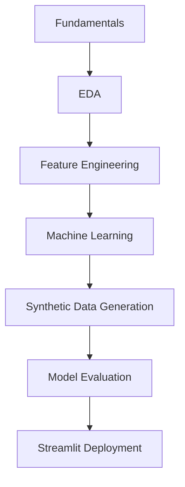

# AI/ML Internship Portfolio – Global Next Consulting India Pvt. Ltd. (GNCIPL)

This repository documents a six-week AI/ML internship at Global Next Consulting India Pvt. Ltd. (GNCIPL). It serves as a comprehensive portfolio demonstrating progressive learning, starting from foundational Exploratory Data Analysis (EDA) and culminating in the development of a complete machine learning project. The internship concluded with an end-to-end Stroke Risk Prediction project that successfully tackled severe data constraints and resulted in an interactive web application.

---

## Internship Overview

- **Duration:** 6 Weeks (October 27, 2025 – December 15, 2025)
- **Organization:** Global Next Consulting India Pvt. Ltd. (GNCIPL)
- **Objective:** To gain hands-on experience across the complete machine learning lifecycle, utilizing industry-standard Python frameworks to build both predictive and generative models.
- **Practical Skills Developed:** The internship fostered rigorous engineering practices, including statistical hypothesis testing, managing severe class imbalances via generative modeling, designing neural network architectures, and developing interactive web applications for model inference.

---

## Technologies & Tools

| Category | Technologies |
| :--- | :--- |
| **Languages & Core** | Python, Pandas, NumPy, SciPy |
| **Machine Learning** | Scikit-Learn, XGBoost, Statsmodels |
| **Deep & Generative AI** | TensorFlow, Keras, SDV, CTGAN |
| **Data Visualization** | Plotly, Matplotlib |
| **Deployment & Ops** | Streamlit, Joblib, pyngrok, Git, GitHub |

---

## Repository Structure

```text
.
├── AIML_week_3.ipynb
├── AIML_week_5.ipynb
├── AIML_week4.ipynb
├── AI_ML_week2_.ipynb
├── Final Report.pdf
├── GNCIPL-AI-ML Week 1 Assignment.ipynb
├── README.md
└── Week_6/
    ├── AIML_week_6_1_EDA_git.ipynb
    ├── AIML_week_6_2_CTGAN_Training_git.ipynb
    ├── AIML_week_6_3_Model_Training_&_Visualization_.ipynb
    ├── AIML_week_6_4_streamlit_stroke.ipynb
    ├── Maaz_Mahboob_Week 6 report.pdf
    ├── README.md
    └── images/
```

---

## Internship Report

A comprehensive report summarizing the internship objectives, weekly progress, methodologies, key learnings, and overall outcomes is included in this repository.

📄 **Final Internship Report:** [Final Report.pdf](Final%20Report.pdf)

---

## Weekly Journey

| Week | Topic | Key Learning | Deliverables |
| :--- | :--- | :--- | :--- |
| **Week 1** | Exploratory Data Analysis | Data preprocessing, feature encoding, and outlier management (winsorization). Extracted actionable univariate and multivariate clinical insights. | [Disease Diagnosis EDA](GNCIPL-AI-ML%20Week%201%20Assignment.ipynb) |
| **Week 2** | Statistical Validation | Parametric (t-tests) and non-parametric (Chi-square) hypothesis testing to rigorously validate risk factor associations. | [Heart Disease Risk Analysis](AI_ML_week2_.ipynb) |
| **Week 3** | Supervised Learning | Machine learning classification using Logistic Regression, Decision Trees, and Random Forest. Model evaluation via Precision, Recall, and F1-score. | [Bank Customer Churn Prediction](AIML_week_3.ipynb) |
| **Week 4** | Unsupervised Learning | Feature engineering for RFM analysis. Applying and validating K-Means clustering (Silhouette Score) to identify customer personas. | [Customer Segmentation](AIML_week4.ipynb) |
| **Week 5** | Deep Learning | Architecting Multi-Layer Perceptrons (MLP) and Deep ANNs. Implementing advanced regularization (Dropout, Batch Normalization) for robust convergence. | [Loan Approval Predictor](AIML_week_5.ipynb) |
| **Week 6** | Generative AI & Deployment | Mitigating severe class imbalance using CTGAN. Full pipeline execution leading to a deployed Streamlit inference web application. | [Stroke Prediction Prototype](Week_6/) |

---

## Internship Progression



---

## Final Capstone Project

The internship concluded with a major Week 6 project targeting **Stroke Risk Prediction**. This project served as an end-to-end demonstration of the skills acquired throughout the program. 

Key technical highlights include:
- **Severe Class Imbalance:** Addressed a heavily skewed dataset (19.52:1 ratio) where positive stroke cases were extremely rare.
- **CTGAN Synthetic Augmentation:** Utilized Conditional Tabular Generative Adversarial Networks (CTGAN) to generate high-quality synthetic minority data, effectively balancing the training environment.
- **Multiple ML Models:** Trained and evaluated Logistic Regression, Random Forest, and XGBoost classifiers, exposing the critical generalization gap between synthetic and untouched real data.
- **Streamlit Prototype:** Deployed the final XGBoost model into an interactive local web application for real-time risk inference.

For a detailed technical case study, please review the [Week 6 README](Week_6/README.md).

---

## Skills Developed

- Data preprocessing
- Exploratory Data Analysis
- Feature Engineering
- Model Training
- Model Evaluation
- Class Imbalance Handling
- Synthetic Data Generation
- Streamlit
- GitHub Documentation

---

## Learning Outcomes

Throughout the internship, my progression evolved from performing isolated data analysis to engineering cohesive, end-to-end machine learning pipelines. I learned to approach data quality systematically, validate assumptions through rigorous statistical testing, and select appropriate algorithms based on the specific constraints of the data. 

Crucially, addressing severe class imbalances with Generative AI (CTGAN) highlighted the complexities of generalization and distribution shifts. This experience shifted my focus from simply optimizing metrics in a vacuum to designing robust, deployable systems that must eventually interact with real-world, untouched data.

---

## How to Explore

To understand the chronological learning path and the evolution of complexity, we recommend exploring the repository in the following order:

1. **Week 1:** [Exploratory Data Analysis](GNCIPL-AI-ML%20Week%201%20Assignment.ipynb)
2. **Week 2:** [Statistical Validation](AI_ML_week2_.ipynb)
3. **Week 3:** [Supervised Learning](AIML_week_3.ipynb)
4. **Week 4:** [Unsupervised Learning](AIML_week4.ipynb)
5. **Week 5:** [Deep Learning](AIML_week_5.ipynb)
6. **Week 6:** [Generative AI Capstone](Week_6/) (Start with the [Week 6 README](Week_6/README.md))

---

## Acknowledgements

I would like to express my sincere gratitude to **Global Next Consulting India Pvt. Ltd. (GNCIPL)** for providing a professional, supportive, and technically challenging environment. The resources, mentorship, and opportunities provided during this 6-week internship were invaluable in enhancing my analytical and engineering capabilities.
