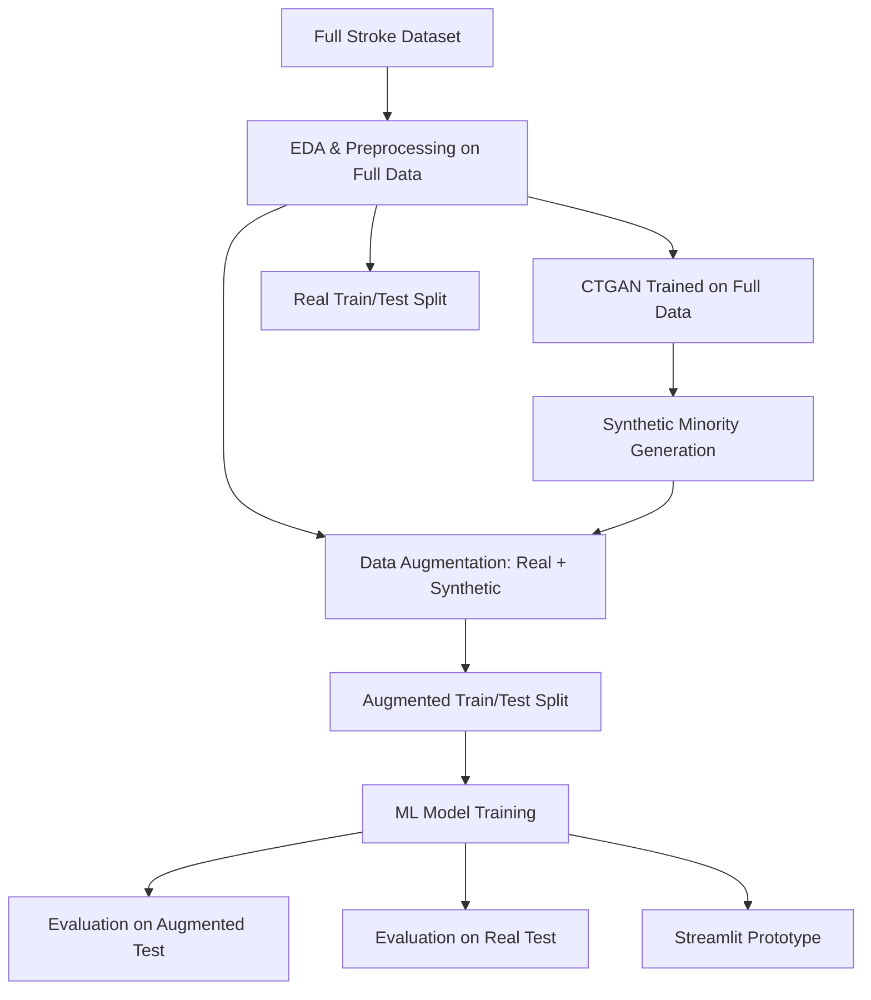
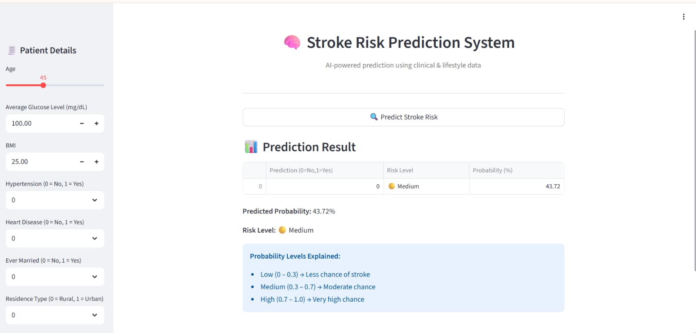

# Stroke Risk Prediction with CTGAN-Based Synthetic Data Augmentation

*A Week 6 AI/ML internship project at Global Next Consulting India Pvt. Ltd. (GNCIPL) exploring severe class imbalance and generative synthetic data.*

## Overview

This project aims to predict stroke risk using a highly imbalanced clinical dataset. To mitigate the scarcity of positive stroke cases, a Conditional Tabular GAN (CTGAN) was utilized to generate synthetic minority samples. Multiple machine learning classifiers were evaluated on the synthetically augmented data as well as on a pure real-data holdout set. The findings reveal a significant synthetic-to-real generalization gap, and the final inference logic was prototyped using a local Streamlit interface.

## The Imbalance Challenge

Clinical datasets often suffer from severe class imbalance, making standard accuracy metrics misleading. In this dataset, the minority class represents less than 5% of the total observations.

| Metric | Value |
| --- | --- |
| **Total Observations** | 5,110 |
| **Predictors** | 11 |
| **Target Variable** | `stroke` |
| **Majority Class (No Stroke)** | 4,861 (95.13%) |
| **Minority Class (Stroke)** | 249 (4.87%) |
| **Imbalance Ratio** | 19.52:1 |
| **Missing Values** | 201 missing in `bmi` |

*Note: Missing BMI values were imputed using group-wise medians, and outliers in `avg_glucose_level` and `bmi` were addressed via 1st–99th percentile winsorization.*

## Project Workflow



*Note: The flowchart reflects the implemented pipeline, which applied preprocessing and CTGAN to the entire dataset before generating the evaluation splits. See the Limitations section for methodological impacts.*

## Notebook Pipeline

| Notebook | Stage | Purpose |
| --- | --- | --- |
| [1_EDA](AIML_week_6_1_EDA_git.ipynb) | EDA & Preprocessing | Handling missing data, encoding, outlier treatment, and class distribution analysis. |
| [2_CTGAN_Training](AIML_week_6_2_CTGAN_Training_git.ipynb) | Synthetic Data Generation | Training CTGAN, generating synthetic stroke cases, and validating real vs. synthetic distributions. |
| [3_Model_Training](AIML_week_6_3_Model_Training_&_Visualization_.ipynb) | Modeling & Evaluation | Training ML classifiers and evaluating performance on both augmented and untouched real data. |
| [4_Streamlit](AIML_week_6_4_streamlit_stroke.ipynb) | Application | Prototyping a local Streamlit interface for model inference. |

## 1. EDA & Preprocessing
Exploratory data analysis identified 201 missing `bmi` values, which were handled via group-wise median imputation. Numerical outliers in `avg_glucose_level` and `bmi` were winsorized at the 1st and 99th percentiles. Categorical variables were converted using label encoding and one-hot encoding, expanding the feature set to 19 predictors.

## 2. CTGAN-Based Synthetic Augmentation
To address the 19.52:1 class imbalance, `sdv.single_table.CTGANSynthesizer` was configured to generate synthetic minority samples. The configuration aimed to balance the dataset without risking severe mode collapse:

- **Training Strategy:** CTGAN was trained on the full dataset before the train/test split.
- **Epochs:** 200 (as configured in the notebook).
- **Synthetic Output:** 2,200 synthetic stroke-positive samples generated.
- **Augmentation Result:** Combined into a 7,310-sample dataset (4,861 majority vs. 2,449 minority), achieving a new imbalance ratio of 1.98:1.

Synthetic data quality was validated via distribution comparisons, correlation heatmaps, PCA, and t-SNE projections to ensure the generated samples reasonably approximated the real minority space.

## 3. Model Training & Evaluation
Three classifiers were evaluated:
- **Logistic Regression** (`C=0.5, max_iter=1`)
- **Random Forest** (`n_estimators=100`)
- **XGBoost** (`n_estimators=200, max_depth=4, learning_rate=0.1`)

The models were evaluated under two entirely distinct conditions to understand how synthetic augmentation impacts performance.

### Augmented Test Evaluation
*(Evaluation set contains synthetic observations)*

The XGBoost model showed exceptionally strong metrics when evaluated on the augmented test data:

| Metric | Score |
| --- | --- |
| **Accuracy** | 0.9692 |
| **Precision** | 0.9977 |
| **Recall** | 0.9102 |
| **F1-Score** | 0.9519 |
| **ROC-AUC** | 0.9846 |

### Untouched Real-Data Evaluation
*(Evaluation set contains pure real observations only)*

When the same XGBoost model was evaluated against the untouched real-data holdout set, the minority-class performance fell substantially:

| Metric | Score |
| --- | --- |
| **Accuracy** | 0.9481 |
| **Precision** | 0.3333 |
| **Recall** | 0.0600 |
| **F1-Score** | 0.1017 |
| **ROC-AUC** | 0.8217 |

## What the Evaluation Revealed
The experimental results demonstrate a critical generalization gap. While the augmented-set metrics were remarkably strong (0.95 F1), the minority-class performance fell to 0.10 F1 on untouched real data. High overall accuracy (94.81%) remained possible exclusively because the underlying real dataset was severely imbalanced (predicting the majority class correctly yields high baseline accuracy).

This experiment highlights that **strong performance on synthetic-influenced evaluation data cannot automatically be interpreted as real-world generalization**. Possible contributors to this gap include synthetic-to-real distribution shift, the model overfitting to synthetic artifacts, the extreme scarcity of real positive samples, and evaluation design choices.

## Streamlit Inference Prototype
A local Streamlit prototype was developed to demonstrate model inference. The application provides:
- Sidebar inputs for all 11 patient features
- Model inference execution
- Stroke probability percentage
- Risk categorization (Low, Medium, High)

### Interface Preview

The following screenshot shows the local Streamlit prototype developed for stroke risk prediction. Users can enter patient information, obtain a predicted stroke probability, and receive a corresponding risk category.


## Tech Stack
- **Data & Analysis:** Python, Pandas, NumPy, SciPy
- **Generative Modeling:** SDV (CTGAN)
- **Machine Learning:** scikit-learn, XGBoost
- **Visualization:** Plotly (Express & Graph Objects)
- **Application:** Streamlit, pyngrok, joblib

## Project Structure
```text
Week_6/
├── AIML_week_6_1_EDA_git.ipynb
├── AIML_week_6_2_CTGAN_Training_git.ipynb
├── AIML_week_6_3_Model_Training_&_Visualization_.ipynb
├── AIML_week_6_4_streamlit_stroke.ipynb
├── Maaz_Mahboob_Week 6 report.pdf
└── README.md
```

## How to Explore
We recommend reviewing the notebooks sequentially:
1. `AIML_week_6_1_EDA_git.ipynb`
2. `AIML_week_6_2_CTGAN_Training_git.ipynb`
3. `AIML_week_6_3_Model_Training_&_Visualization_.ipynb`
4. `AIML_week_6_4_streamlit_stroke.ipynb`

*Reproducibility Note:* This project was originally developed in Google Colab and utilizes hard-coded Google Drive paths alongside ngrok execution strategies. There is currently no `requirements.txt`. To run this repository locally, users will need to:
- Update the hard-coded file paths in the notebooks.
- Manually install required dependencies (`pandas`, `numpy`, `scipy`, `scikit-learn`, `xgboost`, `sdv`, `plotly`, `streamlit`, `pyngrok`, `joblib`).

## Limitations
- **Data Leakage in Preprocessing:** Missing value imputation and winsorization were applied to the full dataset prior to the train/test split.
- **CTGAN Training Context:** CTGAN was trained on the entire real dataset before splitting the real evaluation holdout, meaning synthetic samples were influenced by test-set information.
- **Augmented Evaluation Integrity:** The augmented test data contained synthetic observations, meaning metrics from that evaluation phase cannot be treated as evidence of real-world generalization.
- **Reproducibility:** Hard-coded Colab paths and ngrok session requirements limit immediate local reproducibility.
- **Performance:** Untouched-real minority-class performance remained weak despite the augmentation effort.

## How I Would Improve the Experiment
Future iterations of this methodology should address the identified limitations by:
- Splitting the real data into strict train/test partitions *before* applying any learned preprocessing or synthetic generation.
- Fitting imputation and scaling solely on the training partition.
- Training CTGAN exclusively on the training partition.
- Maintaining a fully untouched real test set to prevent synthetic test contamination.
- Evaluating models with stratified cross-validation.
- Investigating probability calibration and optimal threshold tuning for the heavily imbalanced real distribution.
- Packaging the repository with reproducible dependencies and relative paths.

## Responsible Use
This is an educational and experimental machine-learning project. It is not a clinical diagnostic tool and should not be used for medical decision-making.

**Author:** Maaz Mahboob
